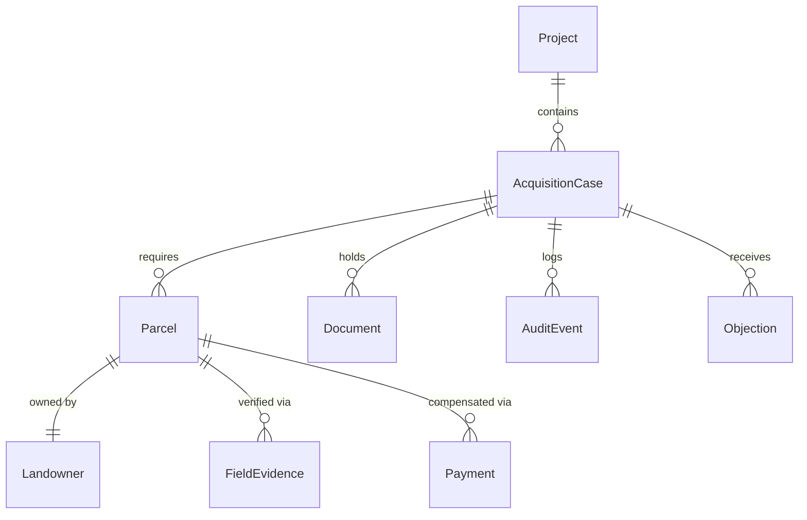

# Bhoomi Setu V2 — National Land Acquisition Operating System

**SIH 2026 · Problem Statement 26016 · Department of Land Resources (DoLR), Government of India**

> **Current Status**: Frontend + real backend foundation. A Fastify/TypeScript API (`server/`) backed by PostgreSQL + PostGIS (Supabase-compatible) serves projects, parcels, jurisdictions, users, organizations, audit events, roles and workflow stages. Admin pages read live API data and fall back to the static demo dataset when the API is offline. Cadastral ingestion and external system integrations are still mocked.

## 1. Overview

Bhoomi Setu is a national operating system designed to digitize and streamline the **complete land acquisition lifecycle** under the Right to Fair Compensation and Transparency in Land Acquisition, Rehabilitation and Resettlement (RFCTLARR) Act, 2013.

It serves as a single source of truth across the administrative hierarchy, connecting project proponents, national and state ministries, district collectors (CALA), field officers, and affected citizens. It transforms a heavily paper-based, fragmented process into a transparent, auditable, and time-bound digital workflow.

## 2. Problem Statement

Land acquisition in India under the RFCTLARR Act involves multiple stakeholders, complex statutory timelines, massive documentation, and coordination across national, state, district, and village levels. Currently, the lack of a unified digital platform leads to:
- Significant delays in project execution due to communication gaps.
- Opaque processes resulting in grievances and litigation from landowners.
- Challenges in monitoring progress at the national/state level.
- Disconnected systems for land records (DILRMP), project planning (PM Gati Shakti), and payments (PFMS).

## 3. Goals

- Provide a single unified platform for 11 distinct roles across the land acquisition lifecycle.
- Enforce statutory timelines (SLAs) with automated alerts and risk monitoring.
- Ensure transparent access to information and compensation tracking for citizens/landowners.
- Enable spatial visibility of land parcels through GIS integration.
- Maintain a strict, immutable audit trail of all decisions and document uploads.

## 4. Non-Goals

- This project is **not** a replacement for the core national land records database (DILRMP); it is a consumer of that data via ULPIN.
- It does **not** handle internal accounting for Requiring Organizations, only the compensation disbursement workflow.

## 5. Key Features

### ✅ Implemented (Frontend + Backend Foundation)
- **Role-Based Access Control (RBAC)**: 11 distinct user roles with jurisdiction-scoped workspaces.
- **Hierarchical Workflows**: Shared state workflow engine advancing cases from proposal to closure.
- **GIS Visualization**: Interactive map interfaces with parcel overlays (via Leaflet).
- **Citizen Portal**: Dedicated interface for landowners to track notices, objections, and payments.
- **Document Vault**: Mocked document repository for storing statutory notices and reports.
- **Audit Trail**: Action logging for accountability — now enforced append-only in PostgreSQL.
- **Backend API**: Fastify + Drizzle modular monolith with real migrations, seed data and integration tests (`server/`).

### 🚧 In Progress / 📋 Planned (National Scale)
- 📋 **Cadastral Data Ingestion**: Importing surveyed parcels from state land-record sources.
- 📋 **DILRMP / ULPIN Integration**: Real-time fetching of ownership data using ULPIN.
- 📋 **PFMS Integration**: Automated direct benefit transfer (DBT) for compensation.
- 📋 **PM Gati Shakti Integration**: Ingesting alignment data for infrastructure projects.
- 📋 **Bhoomi Rashi Integration**: Interoperability for MoRTH highway projects.
- 📋 **Supabase Auth**: Replacing the development actor header with JWT-based login.

## 6. User Roles & Access Model

The system enforces a strict National → State → District → Tehsil → Village hierarchy. Jurisdiction determines data visibility and workflow responsibilities.

| Role | Scope | Purpose & Permissions |
| ---- | ----- | --------------------- |
| **National Admin / DoLR** | National | Apex oversight, audit, and monitoring across all states. |
| **Ministry Nodal Officer** | Ministry | Sponsoring ministry monitoring (e.g., MoRTH, MoD) for sanctioned projects. |
| **Requiring Organization** | Project | Project proponent (NHAI, Railways, PWD) submitting land requirements and depositing funds. |
| **State Nodal Officer** | State | Coordinates acquisition across districts; monitors SLAs for the state. |
| **District Collector / CALA** | District | Statutory decision-maker (Competent Authority). Issues notices, hears objections, declares awards. |
| **Tehsil / SDO** | Tehsil | Sub-divisional scrutiny, verification, and localized coordination. |
| **Field Officer / VAO** | Village | Ground-level verification, measurement, panchnama, and GPS evidence capture. |
| **SIA Expert Group** | District | Independent body conducting Social Impact Assessment and public hearings. |
| **R&R Officer** | District | Manages Rehabilitation & Resettlement entitlements and colony development. |
| **Finance Officer** | District | Computes compensation, processes awards, and initiates disbursement (PFMS). |
| **Citizen / Landowner** | Village (Own) | Affected individual tracking notices, filing objections, and receiving compensation. |

## 7. System Architecture

```mermaid
flowchart TD
    User([Users / 11 Roles])

    subgraph Frontend [React SPA (Vite)]
        Router[React Router]
        UI[Tailwind + shadcn/ui]
        Map[Leaflet / React-Leaflet]
        ApiClient[src/services/api client]
    end

    subgraph StateManagement [Zustand Stores]
        Session[Session/RBAC Store]
        Domain[Domain/Case Store]
        MockDB[(Static demo data)]
    end

    subgraph Backend [Fastify API (server/)]
        Routes[Route layer]
        Service[Service layer]
        Repo[Repository layer]
        Db[(PostgreSQL + PostGIS)]
    end

    User --> Router
    Router --> UI
    UI --> Map
    UI <--> Session
    UI <--> Domain
    Domain <--> MockDB
    UI --> ApiClient
    ApiClient -->|/api, /health| Routes
    Routes --> Service
    Service --> Repo
    Repo --> Db
```

> **Note**: The browser talks to the Fastify API over `/api` and `/health` (Vite proxy in development). Zustand stores still drive the role workspaces that have not yet been migrated; the three admin directory pages (Organizations, Users & Roles, Audit Trail) read live API data and fall back to the static demo dataset with a visible "Demo data — API offline" badge if the API is unreachable.

## 8. Technology Stack

| Layer | Technology | Purpose |
|------|------------|---------|
| **Frontend Framework** | React 18, TypeScript 5, Vite 5 | Core application shell and UI rendering. |
| **Styling & UI** | Tailwind CSS 3.4, shadcn/ui, Radix UI | Accessible, institutional design system. |
| **State Management** | Zustand 4 | Lightweight global state for mocked backend data. |
| **Routing** | React Router 6 | Client-side routing and role-based redirects. |
| **Mapping / GIS** | Leaflet, React-Leaflet | Geospatial rendering of land parcels. |
| **Charts** | Recharts | Dashboards and analytics visualization. |
| **Icons** | Lucide React | Standardized iconography. |
| **API Server** | Fastify 5, TypeScript 5 | REST API for projects, parcels, jurisdictions, users, orgs, audit, workflow. |
| **ORM / Migrations** | Drizzle ORM + SQL migrations | Typed queries, checksum-tracked schema migrations. |
| **Database** | PostgreSQL 16 + PostGIS 3.4 (Supabase-compatible) | Relational storage with geometry columns for cadastral parcels. |
| **Validation / Tests** | Zod 3, Vitest 3 | Request validation; real-database integration tests. |

## 9. Repository Structure

```text
bhoomisetu/
├── src/
│   ├── app/           # Router configuration and role redirect logic
│   ├── components/    # Reusable UI components (shadcn primitives, shell)
│   ├── features/      # Role-specific workspaces (e.g., admin, collector-cala, citizen)
│   ├── lib/           # Utility functions (formatting, stages definition)
│   ├── mocks/         # Mock data generators (cases, parcels, officers)
│   ├── services/api/  # Typed HTTP client for the Fastify backend
│   ├── stores/        # Zustand stores simulating the backend
│   └── types/         # TypeScript domain models and RBAC definitions
├── server/
│   ├── src/
│   │   ├── db/        # Drizzle schema, migrations, seed, migration runner
│   │   ├── modules/   # Route → service → repository per resource
│   │   ├── plugins/   # Auth boundary, error contract
│   │   └── shared/    # Roles, stages, validation, errors
│   └── tests/         # Vitest integration tests against a real test database
├── package.json       # Frontend dependencies
├── tailwind.config.ts # Tailwind CSS configuration
└── vite.config.ts     # Vite bundler configuration + /api proxy
```

## 10. Core Modules

### Role Workspaces (`src/features/*`)
**Purpose**: Provide customized dashboards and action queues tailored to the specific responsibilities of each of the 11 roles.
**Dependencies**: `sessionStore.ts`, `caseStore.ts`, `rbac.ts`.

### Shared Domain Store (`src/stores/caseStore.ts`)
**Purpose**: Acts as the central nervous system simulating the backend database.
**Responsibilities**: Manages the state transitions of `AcquisitionCase`, stores `Parcel` arrays, logs `AuditEvents`, and updates `Payment` statuses.

### RBAC Engine (`src/types/rbac.ts`)
**Purpose**: Controls access and data visibility.
**Responsibilities**: Provides `canAccess(roleId, stage)` and `jurisdictionFilter(roleId, case)` to ensure users only see and interact with data within their legal authority.

## 11. End-to-End Workflows

**The Standard Land Acquisition Pipeline (RFCTLARR):**

1. **Project Proposal**: Requiring Org submits a land requirement request.
2. **Scrutiny**: State/Collector reviews the requirement.
3. **SIA**: SIA Expert Group conducts Social Impact Assessment.
4. **Preliminary Notification (Sec 11)**: CALA issues notice; GIS parcels are frozen.
5. **Objections (Sec 15)**: Citizens file objections; CALA/Tehsil conducts hearings.
6. **Declaration (Sec 19)**: Final declaration of intended acquisition.
7. **Field Verification**: Field Officer captures GPS evidence and verifies ownership.
8. **Award (Sec 23)**: Finance Officer computes compensation; CALA approves.
9. **Payment**: Funds disbursed via PFMS.
10. **Possession**: State takes physical possession of the land.

## 12. Data Architecture



*Note: This diagram represents the conceptual domain model implemented via TypeScript types in `src/types/domain.ts`.*

## 13. Database

**Implemented** — PostgreSQL 16 + PostGIS 3.4, schema managed by versioned SQL migrations in `server/src/db/migrations/`.

- `0001_init.sql` — creates the extension, drops any pre-existing *empty* un-versioned tables (refuses to drop non-empty ones), then creates `roles`, `jurisdictions`, `organizations`, `users`, `datasets`, `dataset_records`, `projects`, `parcels` (with `geometry(Geometry,4326)` + GiST index), `parcel_assignments`, `workflow_instances`, `workflow_transitions`, `documents`, `audit_events` (append-only trigger), `notifications`.
- `0002_seed_roles.sql` — the canonical 11-role reference table.
- `server/src/db/seed.ts` — deterministic development seed with fixed UUIDs (jurisdictions, organizations, users, 3 projects, 6 parcels, workflow instances, audit events).

Migrations are checksum-tracked in `schema_migrations`; editing an applied migration is rejected.

**Local database**: Docker container `bhoomi-setu-db` (`postgis/postgis:16-3.4`) at `localhost:5432`. Connection strings live in `.env` / `server/.env` (both gitignored) — see `.env.example`. A Supabase project uses the same schema; nothing in the codebase is Supabase-specific.

## 14. API Documentation

**Implemented** — Fastify + TypeScript under `server/src`, layered `route → service → repository → database`, validated with Zod.

| Method | Path | Notes |
| ------ | ---- | ----- |
| GET | `/health` | Public. DB connectivity, PostGIS version, applied migrations. |
| GET | `/api/projects` | Filters: `q`, `state`, `status`, `stage`, `limit`, `offset`. |
| GET | `/api/projects/:id` | 404 for unknown id, 400 for malformed id. |
| POST | `/api/projects` | Creates project + workflow instance + audit event in one transaction. |
| GET | `/api/parcels` | Filters: `projectId`, `district`, `classificationStatus`, pagination. |
| GET | `/api/parcels/:id` | `includeGeometry=true` returns the GeoJSON polygon. |
| GET | `/api/jurisdictions` | `tree=true` returns the nested national→village hierarchy. |
| GET | `/api/jurisdictions/:id` | Single jurisdiction. |
| GET | `/api/users` | Filters: `q`, `roleId`, `status`, pagination. |
| GET | `/api/organizations` | Filters: `q`, `orgType`, `status`, pagination. |
| GET | `/api/roles` | The 11 canonical roles. |
| GET | `/api/workflow/stages` | Canonical 17-stage lifecycle + owner roles + SLAs. |
| GET | `/api/audit` | Filters: `action`, `entityType`, `entityId`, `actorUserId`, pagination. |

All `/api/*` routes require an actor; errors share one contract: `{ "error": { "code", "message", "details?" } }` with `400 VALIDATION_ERROR`, `401 UNAUTHENTICATED`, `403 FORBIDDEN`, `404 NOT_FOUND`, `409 CONFLICT`, `500 INTERNAL_ERROR`.

## 15. Authentication & Security

**Status**: development boundary in place; production auth planned.
- **Authentication**: `AUTH_MODE=development-header` — the browser sends `x-actor-id` (a seeded user id; `VITE_DEV_ACTOR_ID`), the server loads that row and takes role / organization / jurisdiction **from the database**. Client-supplied claims are ignored. Next step is Supabase JWT → `users.auth_subject`.
- **Authorization**: enforced server-side per route; frontend RBAC (`RoleRedirect.tsx`, `rbac.ts`) remains a UI concern only.
- **Audit**: `audit_events` is append-only, enforced by a database trigger — updates and deletes raise an error.
- **Secrets**: service-role keys and `DATABASE_URL` are server-side only (`server/.env`, gitignored). Vite only exposes `VITE_*` variables to the browser.
- **Security Limitations**: role workspaces that still use Zustand stores are client-only; their data and logic are not yet enforced by the backend.

## 16. Configuration

Copy the examples and fill in real values (never commit either file — both `.env` and `server/.env` are gitignored):

```bash
cp .env.example .env          # backend + frontend variables
cp server/.env.example server/.env   # backend-only alternative
```

| Variable | Where | Purpose |
| -------- | ----- | ------- |
| `DATABASE_URL` | backend | PostgreSQL/PostGIS connection string (required). |
| `PORT`, `HOST`, `CORS_ORIGIN` | backend | API server bind + allowed origin (default `4000`, `0.0.0.0`, `http://localhost:3000`). |
| `AUTH_MODE` | backend | `development-header` (default) or `disabled`. |
| `SUPABASE_URL`, `SUPABASE_SERVICE_ROLE_KEY` | backend | Reserved for Supabase Auth/Storage — server side only, never shipped to the browser. |
| `VITE_API_BASE_URL` | frontend | API origin; empty means same origin (Vite proxy in dev). |
| `VITE_DEV_ACTOR_ID` | frontend | Development actor id sent as `x-actor-id`. |

## 17. Local Development Setup

**Prerequisites**:
- Node.js (v20 or higher)
- npm
- Docker (for the local PostgreSQL + PostGIS container)

```bash
# Clone the repository
git clone <repository-url>
cd bhoomisetu

# Install dependencies
npm install
npm --prefix server install

# Start PostgreSQL + PostGIS (local development)
docker run -d --name bhoomi-setu-db -p 5432:5432 \
  -e POSTGRES_USER=bhoomi -e POSTGRES_PASSWORD=bhoomi2026 -e POSTGRES_DB=bhoomisetu \
  postgis/postgis:16-3.4

# Configure environment
cp .env.example .env
cp server/.env.example server/.env

# Create schema + seed reference/demo data
npm --prefix server run migrate
npm --prefix server run seed
```

## 18. Running the Application

### Backend API
```bash
npm --prefix server run dev       # http://localhost:4000 (health at /health)
```

### Frontend Development Server
```bash
npm run dev
```
The application will be available at `http://localhost:3000`; `/api` and `/health` are proxied to the API server.

### Production Build
```bash
npm run build
npm run preview
```

## 19. Testing

- **Frontend**: `npm run typecheck` (TypeScript), `npm run lint` (Oxlint).
- **Backend**: `npm --prefix server run typecheck`, plus real-database integration tests:
  ```bash
  npm --prefix server run test
  ```
  Tests bootstrap a separate `bhoomisetu_test` database (create → migrate → seed) and cover `/health`, project create/retrieve, validation and conflict errors, 404s, parcel geometry retrieval, the jurisdiction hierarchy, audit event creation and append-only enforcement. Nothing about the database is mocked.

Unit and E2E browser testing (Playwright) are planned but not yet implemented.

## 20. Deployment

Deployment configuration is not currently included. The application can be built into a static SPA bundle using `npm run build` and hosted on any static file server (e.g., Vercel, Netlify, AWS S3).

## 21. External Integrations

*All integrations listed below are architecturally planned and simulated in the UI, but **not yet technically connected** via APIs.*

- **DILRMP / ULPIN**: To fetch authoritative land records (Khata/Khasra details) based on the Unique Land Parcel Identification Number.
- **PFMS (Public Financial Management System)**: For seamless, audited disbursement of compensation directly to landowner bank accounts.
- **PM Gati Shakti**: To import geospatial alignment data for infrastructure projects.
- **Bhoomi Rashi**: Interoperability for MoRTH-specific National Highway acquisition projects.

## 22. Error Handling

UI errors are handled with standard React error boundaries and localized toast notifications. The API returns a single error contract (`{ error: { code, message, details } }` with 400/401/403/404/409/500), and the frontend client (`src/services/api/client.ts`) converts non-2xx responses and network failures into a typed `ApiError` — admin pages catch it and fall back to the demo dataset with a visible badge.

## 23. Observability

**Partially implemented.** The API uses structured (pino) request logging and `/health` exposes database latency, PostGIS version and applied migrations. External tracing (Sentry, DataDog) is planned for the production release.

## 24. Development Conventions

- **Typing**: Strict TypeScript interfaces defined in `src/types/`.
- **Styling**: Utility-first CSS via Tailwind, encapsulated in modular shadcn/ui components.
- **Routing**: Feature-based folder structure matching route paths.

## 25. Current Implementation Status

| Component | Status | Notes |
| :--- | :--- | :--- |
| **RBAC & Routing** | ✅ Implemented | Complete for all 11 roles. |
| **Workspaces / UI** | ✅ Implemented | Responsive dashboards for all roles. |
| **GIS Mapping** | ✅ Implemented | Leaflet integration with PostGIS-backed parcel geometry available via API. |
| **Backend API** | ✅ Implemented (foundation) | Fastify + Drizzle; projects, parcels, jurisdictions, users, organizations, roles, workflow stages, audit. |
| **Database** | ✅ Implemented (foundation) | PostgreSQL 16 + PostGIS 3.4, versioned migrations, deterministic seed, append-only audit. |
| **Admin pages on live data** | ✅ Implemented | Organizations, Users & Roles, Audit Trail read the API with demo fallback. |
| **Integration tests** | ✅ Implemented | Vitest against a real `bhoomisetu_test` database (20 tests). |
| **PFMS / ULPIN / DILRMP** | 📋 Planned | UI elements exist; API integration pending. |
| **Production authentication** | 📋 Planned | Development actor header in place; Supabase JWT next. |

## 26. Known Limitations

- **Partial migration**: Role workspaces still read from Zustand stores; refreshing the browser resets case progression and uploaded documents for those screens. Directory data served by the API (projects, parcels, jurisdictions, users, organizations, audit) persists.
- **Mocked integrations**: All ULPINs, PFMS transaction IDs, and citizen details are fictional; no external system is connected.
- **Security**: `/api` routes resolve the actor's role/organization/jurisdiction server-side, but workspaces remain client-side until they are migrated to the API.
- **Performance**: Large datasets (thousands of parcels) may cause UI lag due to client-side filtering.

## 27. Roadmap

### Near Term
- Replace the development actor header with JWT-based authentication (Supabase Auth / e-Pramaan).
- Migrate the remaining role workspaces and mutations from Zustand to the API.
- Cadastral parcel ingestion pipeline with ULPIN identifiers.

### Medium Term
- Establish real-time API integrations with DILRMP for fetching verified land records.
- Implement a secure payment gateway integration with PFMS.

### Long Term
- National rollout capability with multi-tenant architecture supporting distinct state rulesets.

## 28. Contributing

As this is a prototype for SIH 2026, external contributions are not currently being accepted.

## 29. License

Academic prototype for SIH 2026. No open-source license has currently been specified.

## 30. Disclaimer

This is a **prototype / proof of concept** developed for the Smart India Hackathon (SIH) 2026. It is a frontend-first simulation. The data, APIs, and integrations described are mocked for demonstration purposes and do not interact with real government databases.
